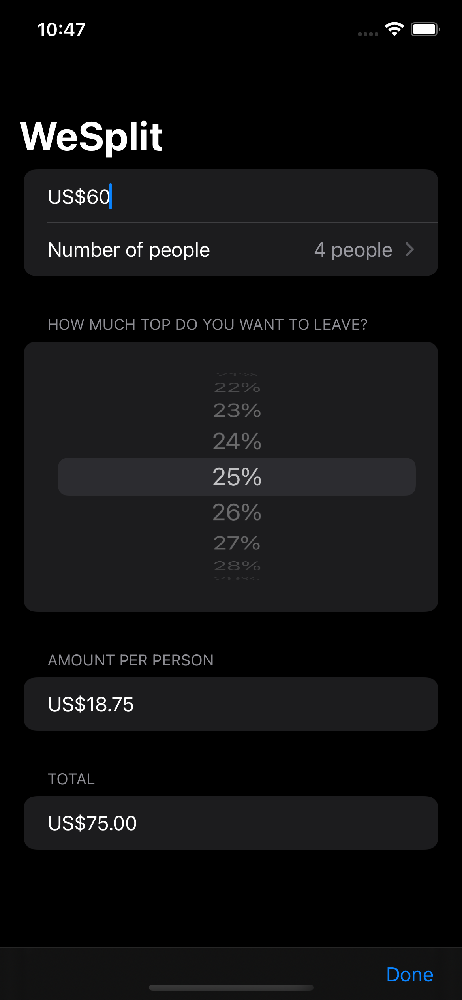

# WeSplit

식당에서 사용할 수 있는 더치페이 앱  

음식 비용을 입력하고, 팁을 얼마만큼 남기고 싶은지, 몇 명을 뽑을 지 선택하면 각 사람이 지불해야 하는 금액을 알려준다.

## 기록

### 기본 파일 구조

- {ProjectName}.swift
    - 앱의 시작점
- ContentView.swift
  - 앱의 초기 사용자 인터페이스를 포함한 곳
- Assets.xcassets
  - 앱에서 사용하는 리소스를 포함한 곳
- Preview Content
  - 또 다른 에셋 카탈로그

### 단축키

- `command + option + enter`
  - 캔버스 열기/닫기
- `command + option + p`
  - 프리뷰 새로고침

### 그 외

- SwiftUI 는 자식을 10개 이상 가질 수 없다.
  - `Extra argument in call` 이라는 오류 메시지가 뜬다.
  - `Form`에서 10개 이상의 자식을 가지려면 `Group`을 사용해야 한다.
    - 사용자 눈에는 다르게 보이지 않는다.
- 네비게이션의 타이틀을 지정할 때, NavigationView 에 지정하는 것이 아니라, 그 내부에 있는 자식 뷰? 컴포넌트?에 지정한다.
- `ContentView`는 상수로 선언될 수 있는 구조체
  - 따라서 값을 자유롭게 변경할 수 없다. 변경하기 위해서 `mutating` 키워드를 추가해야 한다.
    - 그러나 Swift 는 계산 프로퍼티(computed property)에 변경을 허용하지 않기 때문에 사용할 수 없다.
  - Swift 는 property wrapper 라는 특별한 솔루션을 제공한다.
- 양방향 바인딩 (예시: 텍스트 필드)
    - 어떤 String 값이 있으면
    - String 을 텍스트 필드에 표시하면서
    - 텍스트 필드의 변경 사항을 String 값에 업데이트(저장)
    - 양방향 바인딩 한다는 것을 `$` 기호로 표시
- ForEach 의 `id:\.self`
  - SwiftUI 는 화면의 모든 뷰를 고유하게 식별할 수 있어야 상황이 변경될 때 감지할 수 있으므로 존재함
  - 문자열 배열에서 어느 값이 고유하는 지를 나타낼때 자기 자신을 가리킴 (그 자체로 고유하다는 뜻)
    - ‼️ 물론 중복값이 있으면 문제가 발생할 수 있음

### @State

https://developer.apple.com/documentation/swiftui/state

> SwiftUI에서 관리하는 값을 읽고 쓸 수 있는 property wrapper 유형

- 값을 읽고 쓰는 수단
- 하나의 뷰를 위한 프로퍼티를 제어하기 위함이므로 `private` 키워드와 함께 쓰는 것을 권장